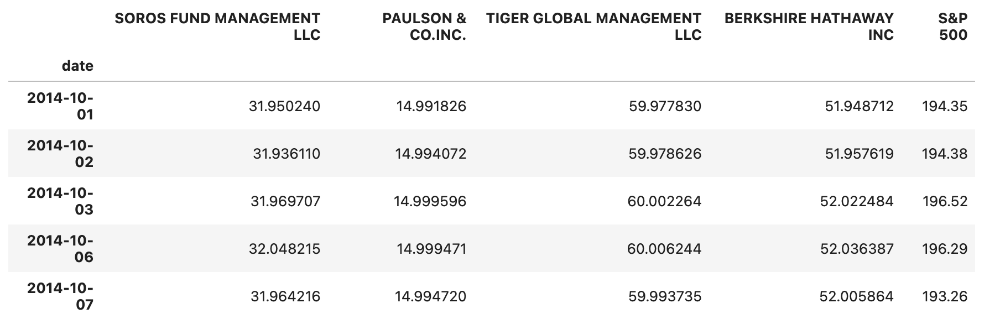
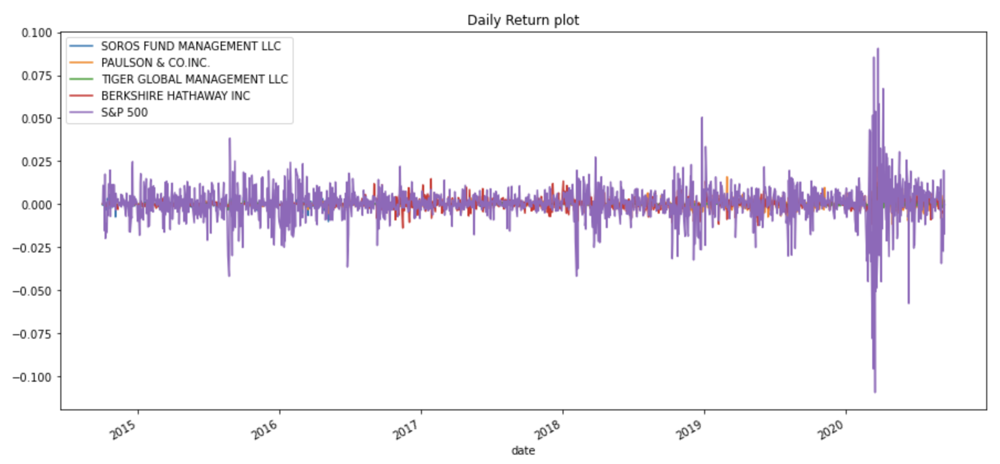

# Quantitative Portfolio Analysis 

*by KELVIN KISSI*

---

## Background

In this Jupyter Notebook, I use Python and Pandas quantitative analytical tools to identify the top-performing portfolios based on volatility, returns, risk, and Sharpe ratios. Through the analysis and visualization of these key metrics, I achieved three main objectives:

* Read in and Wrangle Returns Data - Preparing the Data
* Determine Success of Each Portfolio - Conducting Quantitative Analysis
* Choose and evaluate custom portfolio - Building a Custom Portfolio (including data preparation and quantitative analysis)
   
---

   
   [Source Code](https://github.com/kelvinkissi/Quantitative-Analysis-With-Pandas/blob/master/risk_return_analysis.ipynb)
   

---

## Read and Clean Data

Read each CSV file into a DataFrame using Pandas. Next, clean the data by converting dates to a DateTimeIndex, identifying and removing all null values, and adjusting data types as necessary. Finally, concatenate all the DataFrames into a single DataFrame to perform quantitative analysis and determine if any portfolios outperform the S&P 500.

## Analyze the Performance

